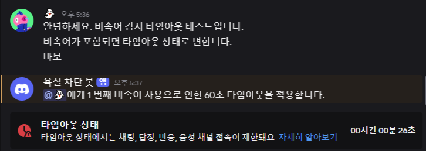

# 🚫clean chatting
오픈 소스를 활용한 욕설 감지 디스코드 봇   

## 1. 프로젝트 개요
디스코드 채팅 메세지에서 욕설을 자동으로 감지하고 일정 시간 채팅을 제한하는 디스코드 봇입니다.
### 제작 배경
비속어와 욕설이 난무하는 디스코드 서버에서 접속 인원이 일정 수준을 넘어가는 경우, 관리자가 해당 서버의 모든 채팅을 확인하는 데 어려움이 있습니다. 해당 문제를 해결하기 위해 비속어 필터링과 유저의 채팅을 제한하는 타임아웃 기능의 자동화가 필요하다.
### 프로젝트 목표
디스코드 채팅에서 비속어를 실시간으로 감지하고, 채팅을 작성한 유저에게 60초 동안 타임아웃을 적용함으로써 관리자의 개입 없이도 서버의 채팅 환경을 쾌적하게 유지하는 것을 목표로 합니다.
### 팀 프로젝트
**김지원**: 오픈소스 분석 및 주석 작성, 기능 통합 
권칠윤: 오픈소스 탐색, 이벤트 처리 기능 구현 
김운학: 최종 테스트, 로그 메시지 처리   

## 2. 주요 기능
- **비속어 필터링🤬**  
  
  - word_detection.py 실행 시 작동
  - 입력 데이터: 유사도 기준(확률), 필터링할 문장
  - 출력 데이터: 비속어가 감지된 경우 원본 비속어, 필터링된 문장  
- **타임아웃 기능⏱**  
  
  - 디스코드 봇 서버에 배포 후 이용
  - 채팅 중 비속어가 감지되면 해당 유저에게 자동으로 타임아웃을 적용  
- **횟수 누적 시간 적용✍**
  
  - 추가 기능
  - 유저별 비속어 사용 횟수를 누적하여 타임아웃 시간 60초씩 증가  
- **로그 메시지📝**  
  
  - 타임아웃 적용 및 해제 시 채널에 로그 메시지 전송   

## 3. Flow Chart
   

## 4. 활용한 오픈소스
- 비속어 필터링: https://github.com/0-inf/KoreanBadwordDetection 
- 타임아웃 기능: https://github.com/psm7177/timeout
